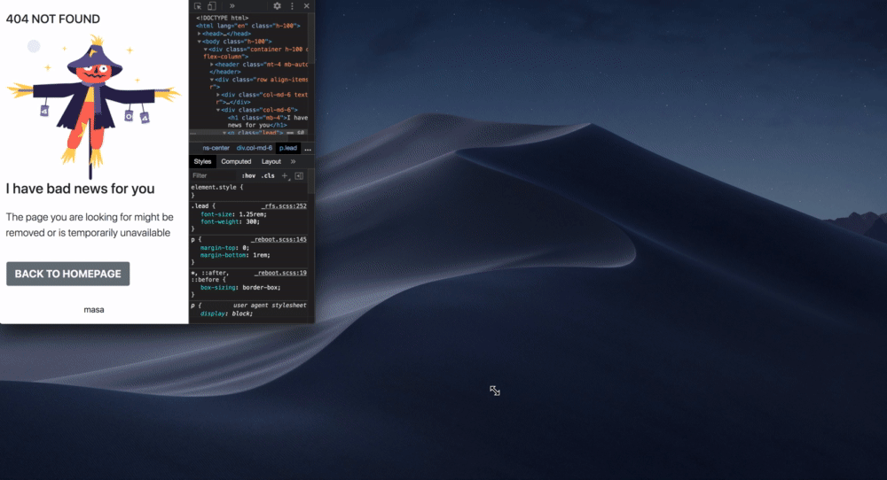

<!-- Please update value in the {}  -->

<h1 align="center">404-not-found-master</h1>

   Solution for a challenge from  <a href="http://devchallenges.io" target="_blank">Devchallenges.io</a>.

  <h3>
    <a href="demo.gif">
      Demo
    </a>
     | 
    <a href="https://not-found-master-579ee.firebaseapp.com/">
      Solution
    </a>
     | 
    <a href="https://devchallenges.io/challenges/wBunSb7FPrIepJZAg0sY">
      Challenge
    </a>
  </h3>

<!-- TABLE OF CONTENTS -->

## Table of Contents

- [Overview](#overview)
- [Built With](#built-with)
- [Features](#features)
- [Contact](#contact)
- [Acknowledgements](#acknowledgements)

<!-- OVERVIEW -->

## Overview

I always feel that css is more difficult than mastering the javascript framework. 
I decided to use bootstrap for the solution of this challenge.

The image of the scarecrow and the message display area are shown in gird. 
Specify "col-md-6" for each, and switch the display to 768px as the breakpoint.

Through this project, I was able to catch up on bootstrap. 
Thanks for taking a look:)

### Built With

<!-- This section should list any major frameworks that you built your project using. Here are a few examples.-->

- [html](https://whatwg.org/)
- [bootstrap](https://getbootstrap.com/)

## Features

<!-- List the features of your application or follow the template. Don't share the figma file here :) -->

This application/site was created as a submission to a [DevChallenges](https://devchallenges.io/challenges) challenge. The [challenge](https://devchallenges.io/challenges/wBunSb7FPrIepJZAg0sY) was to build an application to complete the given user stories.

## Acknowledgements

<!-- This section should list any articles or add-ons/plugins that helps you to complete the project. This is optional but it will help you in the future. For exmpale -->

- [Steps to replicate a design with only HTML and CSS](https://devchallenges-blogs.web.app/how-to-replicate-design/)

## Contact

- GitHub [@masa-fullstack](https://github.com/masa-fullstack)
- Twitter [@masa_fullstack](https://twitter.com/masa_fullstack)
